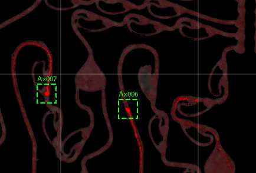

# AxTrack

## Installation
Clone the repo:

    git clone --recursive https://github.com/LoaloaF/axtrack.git    

Create anaconda env and install the submodules:

    conda env create --file axtr.yml
    conda activate axtr
    cd axtrack/libmot && python setup.py install develop --user
    cd ../pyastar2d && python setup.py install develop --user

Download model & example data:
              
    curl https://polybox.ethz.ch/index.php/s/Run8gaUVT45hmjX/download > deployed_model/E1000.pth
    curl https://polybox.ethz.ch/index.php/s/qlOKY3asRdcnmKh/download > examples/example_timelapse.tif

## Quickstart
Run the included example:\
`python example/test.py`

The example goes through the three simple steps of tracking axons in a 3D-grayscale-tif file.

    
    import axtrack
    
    # first setup the directories for reading and writing data
    parameters, model, stnd_scaler = axtrack.setup_inference(dest_dir)
    
    # create the input data object
    timelapse = axtrack.prepare_input_data(imseq_fname, parameters, dest_dir, inference_data_dir,
                                stnd_scaler, mask_fname=mask_fname, use_cached_datasets=use_cached_datasets, 
                                check_preproc=check_preproc, input_metadata=input_metadata)

    # get axon detections
    axon_dets = axtrack.inference(timelapse, model, dest_dir, parameters, 
                                    detections_cache=cache_detections,
                                    astar_paths_cache=astar_paths_cache,
                                    assigedIDs_cache=assigedIDs_cache)

    dets = axon_dets.IDed_dets_all
    
test.py should create the video below.\

# Train on new data
To improve performance on your dataset you may consider labelling a subset of your data and retraining the model. To do this, label a timelapse using the jupyter notebooks in `./data_prep_nbs/`. Then, train on your data by running `./experiment/experiment.py`.
